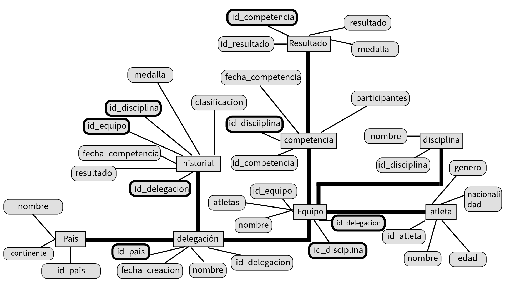
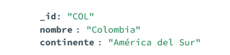
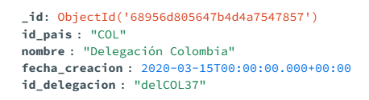
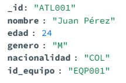
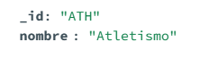
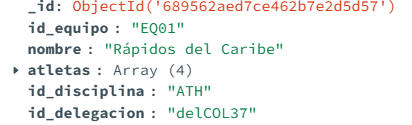
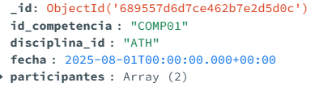
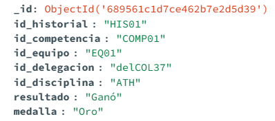

# ⚽ Modelado de base de datos de GLOBALSPORTS-UNION 

En este archivo .md se presenta el modelado propuesto para la base de datos de las competencias deportivas de Global Sports.
Incluye el esquema conceptual, la descripción de las entidades con sus respectivos campos y la justificación de cómo este diseño satisface los requerimientos funcionales y estructurales establecidos para la arquitectura del sistema.

## 🖊️ Esquema conceptual

En el esquema conceptual se presentan las diferentes entidades que serían creadas, junto con las referencias que tendrían hacia otras colecciones.

## 💁 Explicación del modelo propuesto

El modelo contaria con 8 colecciones en total que serian:

### pais

Esta colección almacena los registros de todos los países que participarán en el torneo.
Cada documento contiene los siguientes campos:

- id_pais (string): Identificador único del país, usualmente el código ISO de tres letras.

- nombre (string): Nombre oficial del país.

- continente (string): Continente al que pertenece el país.

### delegación 

Esta colección almacena la información de cada delegación que representa a un país en el torneo.
Cada documento contiene los siguientes campos:

- _id: campo autogenerado

- id_delegacion (string): Identificador único de la delegación.

- id_pais (string): Código del país al que pertenece la delegación (referencia a la colección País).

- nombre (string): Nombre oficial de la delegación.

- fecha_creacion (date): Fecha en la que se fundó o registró la delegación.

### Atletas

Esta colección almacena la información de cada atleta que participa en el torneo.
Cada documento contiene los siguientes campos:

- id_atleta (string): Identificador único del atleta.

- nombre (string): Nombre completo del atleta.

- edad (number): Edad del atleta.

- genero (string): Género del atleta (por ejemplo, "M" para masculino o "F" para femenino).

- nacionalidad (string): Código del país al que pertenece el atleta (referencia a la colección País).

### Disciplina

Esta colección contiene el registro de todas las disciplinas deportivas incluidas en el torneo.
Cada documento cuenta con los siguientes campos:

- id_disciplina (string): Identificador único de la disciplina, normalmente en formato ISO o abreviatura (por ejemplo, "ATH" para Atletismo).

- nombre (string): Nombre completo de la disciplina deportiva (por ejemplo, "Atletismo", "Natación", "Boxeo").

### Equipo

Esta colección almacena la información de los equipos que participan en las competencias.
Cada documento cuenta con los siguientes campos:

- _id: campo autogenerado

- id_equipo (string): Identificador único del equipo (por ejemplo, "EQ01").

- nombre (string): Nombre oficial del equipo (por ejemplo, "Rápidos del Caribe").

- atletas (array[string]): Lista con los identificadores de los atletas que conforman el equipo.

- id_disciplina (string): Identificador de la disciplina a la que pertenece el equipo, en referencia a la colección Disciplina.

- id_delegacion (string): Identificador de la delegación nacional a la que pertenece el equipo, en referencia a la colección Delegación.

### Competencia

Esta colección almacena los registros de las competencias que se llevan a cabo durante el torneo.
Cada documento cuenta con los siguientes campos:

- _id: campo autogenerado

- id_competencia (string): Identificador único de la competencia (por ejemplo, "COMP01").

- disciplina_id (string): Identificador de la disciplina en la que se desarrolla la competencia, en referencia a la colección Disciplina.

- fecha (date): Fecha en la que se realiza la competencia.

- participantes (array[string]): Lista con los identificadores de los equipos que compiten en la disciplina especificada, en referencia a la colección Equipo.

### Resultado

Esta colección registra los resultados de cada competencia disputada durante el torneo.
Cada documento cuenta con los siguientes campos:

- _id: campo autogenerado

- id_resultado (string): Identificador único del resultado (por ejemplo, "RES01").

- id_competencia (string): Identificador de la competencia a la que pertenece el resultado, en referencia a la colección Competencia.

- id_equipo (string): Identificador del equipo participante, en referencia a la colección Equipo.

- resultado (string): si gano o perdio el equipo 

- medalla (string): medalla ganada por el equipo

### Resultado

esta coleccion contiene el historial que tiene la delegacion con las competencias que su equipo ha asistido, sin importar si ganaron o perdieron

- _id: campo autogenerado

- id_historial (string): id para historial

- id_competencia (string): referencia a la coleccion de competencias

- id_equipo (string): referencia al equipo que participo en esa competencia

- id_delegacion (string): referencia a la delegación participante 

- id_disciplina (string): referencia a la disciplina a la que se enfocó la competencia

- resultado (string): dice si el equipo ganó o perdió

- medalla (string): medalla de oro o si no no se muestra el campo.

## 🧩 Caracteristicas del modelo propuesto

- Modularidad: El modelo separa claramente cada entidad para facilitar consultas específicas y mantenimiento.

- Referencias Cruzadas: Uso de identificadores únicos para vincular colecciones garantiza integridad referencial y facilita la navegación entre entidades.

- Escalabilidad: Estructura preparada para agregar nuevas disciplinas, países, atletas y competencias sin modificar el esquema base.

- Compatibilidad con Requisitos: El diseño cumple con la necesidad de registrar información completa de delegaciones, equipos, competencias y resultados, permitiendo reportes históricos y estadísticas.

- Flexibilidad: Campos opcionales como medalla en resultado e historial permiten manejar distintos casos según desempeño sin perder coherencia.

## 🏁 Conclusión
El modelado de base de datos propuesto para GLOBALSPORTS-UNION ofrece una estructura clara, robusta y escalable que facilita la gestión integral de las competencias deportivas. Mediante la definición cuidadosa de colecciones y sus relaciones, el diseño permite almacenar y consultar de manera eficiente información clave sobre países, delegaciones, atletas, disciplinas, equipos, competencias y resultados. Esta arquitectura no solo satisface los requerimientos funcionales actuales, sino que también está preparada para adaptarse a futuras ampliaciones del sistema. Así, GLOBALSPORTS-UNION podrá garantizar un seguimiento detallado y confiable del desarrollo del torneo, apoyando la toma de decisiones y el análisis estadístico para mejorar continuamente la experiencia deportiva.

